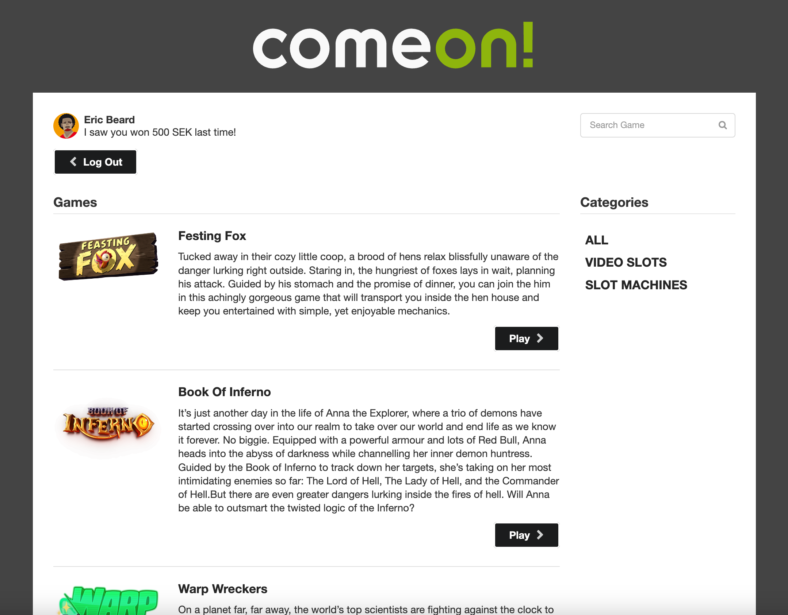

# React-Gaming-App

This repository contains my solution With React for the ComeOn! I have successfully completed the assigned tasks and integrated the necessary functionality into the provided HTML and data. Below is an overview of the implemented features:

## Assignment Overview

The assignment involved using React to tie together existing HTML and data to create a minimal, working casino website. Basic HTML, CSS, images, and JSON data were provided, and I have made improvements to enhance the overall user experience.

## Assignment Criteria

The following tasks have been completed as part of the assignment:

### Login functionality

* Connected the login form to the /login ajax call.
* On a valid username/password, transitioned to the games list screen.
* On an invalid username/password, provided feedback and allowed the user to try again.

### Log out functionality

* Connected the log out button to the /logout ajax call.
* On a valid log out, transitioned to the login screen with empty input fields.

### Games list screen

* Requires user to be logged in.
* Listed all games from the /games ajax call.
* Listed categories from /categories ajax call.
* Provided functionality for filtering by typing.
* Provided functionality to filter by category.
* Made it possible to start a game by clicking on the play icon.

### Game play screen

* Requires user to be logged in.
* Loaded the selected game via the provided API.
* Provided a way to go back to the Games list screen.
